# Flink Checkpoint 性能与容错机制研究


> **摘要**：本项目基于纽约出租车数据集，深入探究了 Flink 检查点（Checkpoint）间隔对系统吞吐量、延迟及故障恢复能力的影响。通过实验数据与理论模型的双重验证，确定了在特定负载下的最佳检查点间隔策略。

## 研究背景与目的

**研究核心**：探究 Checkpoint 间隔对性能（吞吐、延迟）与容错能力（恢复时间）的权衡。

**具体内容**：

1. 分析不同 Checkpoint 间隔下的性能表现。
2. 研究如何在高性能与高可用之间取得平衡。
3. 结合理论模型验证实验结果的合理性。

## 系统架构与流程

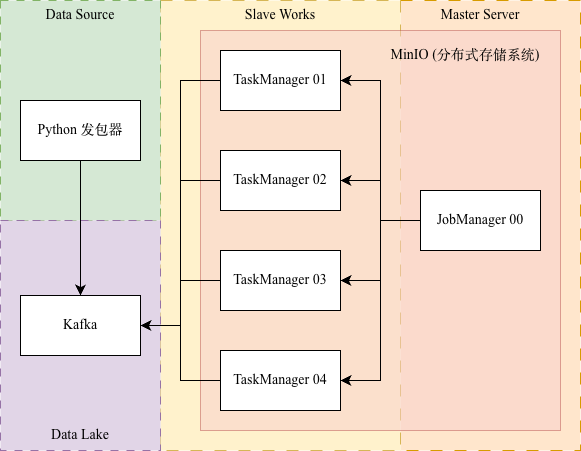

本实验采用经典的 **Source - Broker - Sink/Process** 架构，具体数据流向如下：

1. **数据生产 (Data Generation)**

   * **组件**：Python 发包器（运行在任意机器上的 `serv_nyc_csv_kafka.py`）。
   * **行为**：脚本读取清洗后的 NYC 出租车 CSV 文件，按照设定倍率（7200x）加速回放，将每行记录序列化后作为 Producer 推送至 Kafka。
2. **数据缓冲 (Data Buffering)**

   * **组件**：Kafka Broker。
   * **行为**：作为高吞吐的消息中间件，Kafka 接收并暂存来自 Python 发包器的数据流，实现计算层与生产层的解耦，确保存储压力不会直接冲击计算集群。
3. **流式计算 (Stream Processing)**

   * **组件**：Flink TaskManager（分布在多台机器）。
   * **行为**：TaskManager 作为 Kafka Consumer，主动从 Topic 中拉取数据。它们负责执行具体的窗口聚合任务（计算 `totalAmount` 和行程数），并根据 JobManager 的指令将状态写入 Checkpoint 存储（MinIO）。
4. **集群协调 (Cluster Coordination)**

   * **组件**：Flink JobManager（运行在 Master 节点）。
   * **行为**：JobManager 不直接参与数据计算，而是负责作业调度、资源管理以及**核心的 Checkpoint 触发与协调**。当发生故障时，它负责从最近的检查点协调 TaskManager 进行状态恢复。

## 实验环境与配置

### 集群配置


| 设备名称 | CPU核心数 | 内存总量 | 网络带宽数 | 存储类型 | 操作系统     |
| -------- | --------- | -------- | ---------- | -------- | ------------ |
| master   | 96        | 1.0TB    | 1000Mb/s   | HDD      | Ubuntu 20.04 |
| slave-01 | 64        | 754GB    | 1000Mb/s   | HDD      | Ubuntu 20.04 |
| slave-02 | 64        | 754GB    | 1000Mb/s   | HDD      | Ubuntu 20.04 |
| slave-03 | 64        | 754GB    | 1000Mb/s   | HDD      | CentOS 7     |
| slave-04 | 64        | 754GB    | 1000Mb/s   | HDD      | Ubuntu 20.04 |

### 环境配置

> JDK 17
>
> Python 3.10
>
> Flink 1.19.3
>
> Kafka 7.4.0
>
> MiniO 2025-09-07T16-13-09Z

## 实验负载

### 1. 数据集 (NYC Taxi)

选用 **2023年1月-6月** 的纽约出租车交易数据（约 1949 万条），具备**计算密集、状态密集、数据密集**的特点。

**预处理策略**：

- 剔除 2023-01-01 之前的脏数据及缺失关键字段的数据。
- 基于时间序列进行全局排序。
- [查看预处理脚本 (sort_nyc_csv.py)](sort_nyc_csv.py)

**核心字段**：


| 字段             | 用途                                             |
| ---------------- | ------------------------------------------------ |
| `pickupDatetime` | 窗口聚合（2小时滚动窗口）的时间基准 (Event Time) |
| `puLocationID`   | 分组键                                           |
| `totalAmount`    | 聚合指标 (Sum)                                   |

### 2. 工作负载 (Workload)

- **回放倍速**：7200倍（模拟1s 处理数据集中 2小时的数据量）。
- **计算逻辑**：2小时滚动窗口，按区域ID（PULocaionID）统计累计收入与行程数。
- **变量控制**：Checkpoint 间隔设置为 **5s, 30s, 5min** 三组。注入故障率固定为10min断掉taskmanager节点一次，一共注入故障三次

### 工作负载设计原理分析

本项目的工作负载设计是经过精心考量的，核心目标是在有限的实验时间内，**高效模拟生产环境下的高负载和实时计算特性**，并精确地衡量不同 Checkpoint 策略带来的影响。

#### 1. 回放倍速：7200倍 (1s = 2h 数据集时间)

设计超高倍速的核心目的是在**短时间内生成具有足够压力和状态规模的数据流**，以充分压测 Flink 集群的性能极限。

* **模拟高吞吐环境**：原始数据集覆盖 6 个月时间，若以实时速度运行，实验周期过长。7200 倍速意味着将现实中的 2 小时（7200 秒）的数据量压缩到 **1 秒钟**内处理。
* **实现集群压测**：这使得 Flink 集群在极短时间内必须处理**海量历史数据**，从而模拟出生产环境中数据高峰期或高并发带来的巨大吞吐量需求，使集群达到瓶颈，能清晰地观察到 Checkpoint 机制的**真实 I/O 和网络开销**。

#### 2. 计算逻辑：2小时滚动窗口 (基于 Event Time)

选择 2小时作为滚动窗口的大小，是为了**与数据回放速度和状态的积累相匹配**，以便观察 Checkpoint 机制的性能。

* **匹配实时性测试**：由于数据是 7200 倍速回放，数据流中一个 **2 小时窗口**在现实时间中**只需要 1 秒**就能处理完成。这允许我们在极快的速度下测试窗口聚合的延迟。
* **产生 Keyed State 压力**：滚动窗口会持续积累 Keyed State（按区域 ID 维护的累计收入和行程数）。这个设计确保了 Flink 在执行 Checkpoint 时有**足够大的状态体积**需要序列化和持久化。这对于观察 **Checkpoint 间隔越长、状态体积越大、Duration 越长**的趋势至关重要。

#### 3. 变量控制：5s, 30s, 5min 三组间隔

这三组差异显著的 Checkpoint 间隔是实验设计的核心，目的是全面探究**性能与容错能力**的权衡。


| 间隔设置          | 实验目的                     | 关注的性能指标                                 | 权衡侧重       |
| :---------------- | :--------------------------- | :--------------------------------------------- | :------------- |
| **5s** (短间隔)   | 模拟极致**容错优先**场景。   | **延迟尖峰**、**吞吐量损失**（因 I/O 频繁）。  | 容错性高       |
| **30s** (中间隔)  | 寻找性能与容错的**平衡点**。 | **稳态吞吐量**、**资源利用率**。               | 性能与容错平衡 |
| **5min** (长间隔) | 模拟极致**性能优先**场景。   | **吞吐量峰值**、**故障恢复时间**（预期最长）。 | 性能高         |

## 实验步骤

### 批量部署免 sudo 配置

```
# 宿主机添加用户到 docker 组
sudo usermod -aG docker $USER

# 宿主机添加 9999 flink 组
sudo groupadd -g 9999 flink

# 宿主机添加用户到 flink 组
sudo usermod -aG flink $USER
```

### 部署步骤

1. 免密登录，在 `.ssh/config` 中配置别名 master, slave-01, slave-02, slave-03, slave-04,
2. 执行脚本 distributed-install.sh，会在用户根目录下生成 flink-checkpoint-taskmanager 文件夹

### 执行步骤

修改服务器信息 `hostname_or_ip`

补全 `flink-s3-fs-hadoop-1.19.3.jar` 和 `nyc-taxi-2023-01-fixed.csv`

注：`nyc-taxi-2023-01.csv` -> `sort_nyc_csv.py` -> `nyc-taxi-2023-01-fixed.csv`

1. 启动 `./master-start.sh`（包含 MinIO，kafka，JobManager）

2. 启动 `./distributed-slaves-start.sh`（启动TaskManager）
   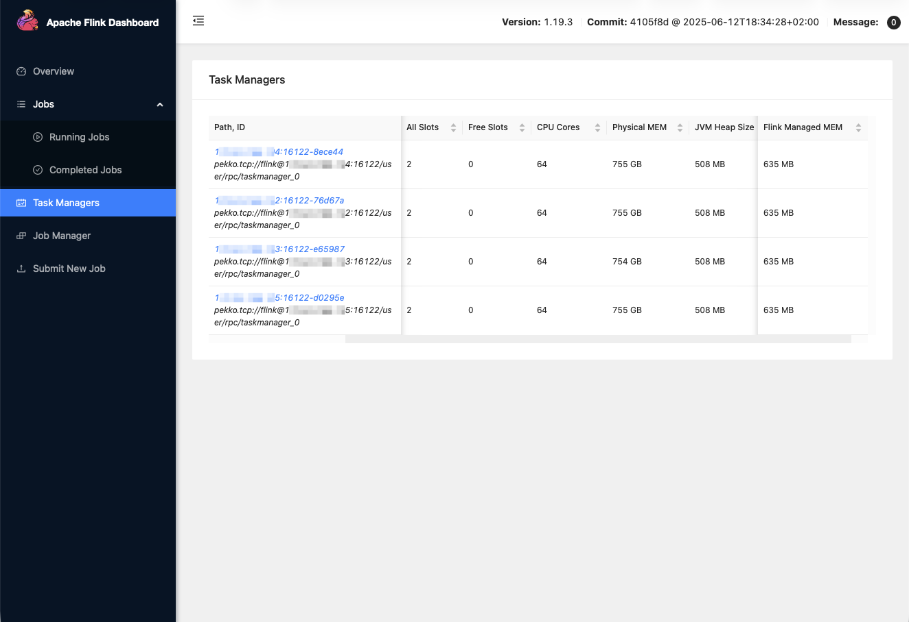

3. 上传作业到 Flink 平台

4. 启动 `python ./serv_nyc_csv_kafka.py`（Python 发包器，作为数据源）
   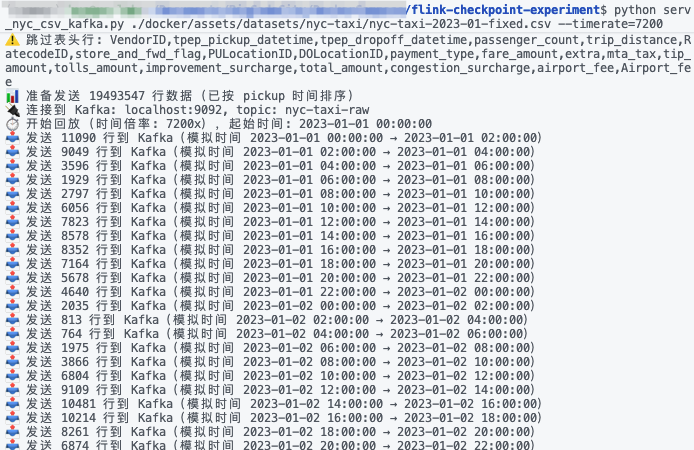

5. 执行作业
   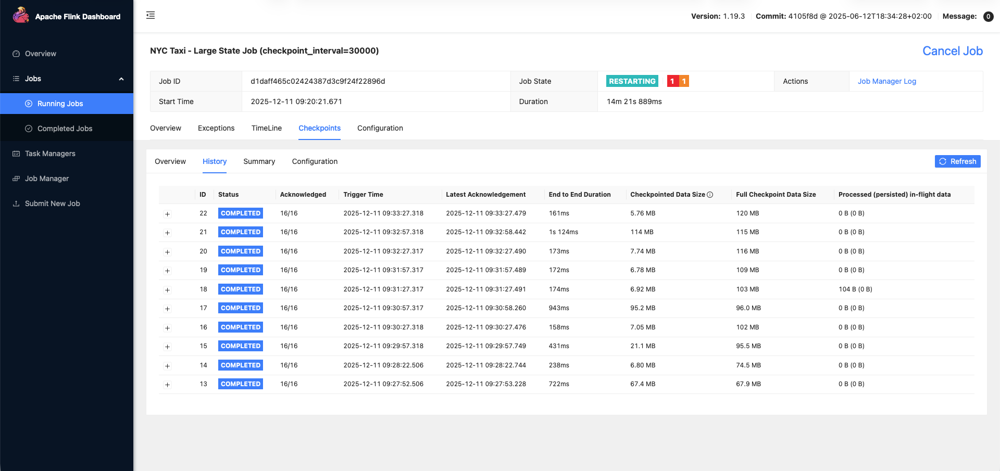

   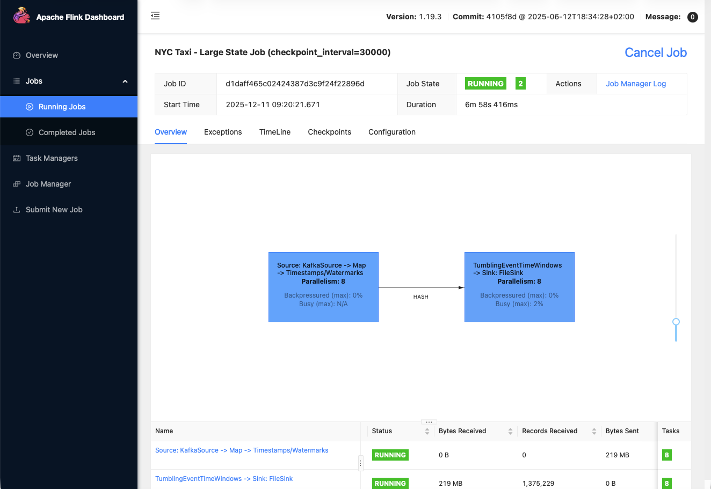

6. 启动 `cd ./monitor/ && ./monitor.py`（用于采集指标）
   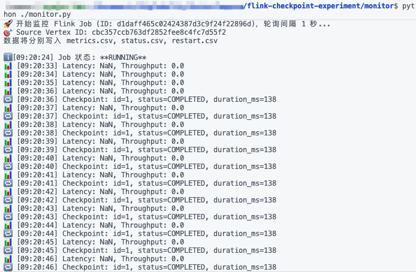

7. 在特定服务器上启动 `./fault.sh`（用于中断模拟)

   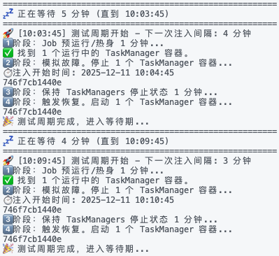

## 实验结果与分析

为了直观展示 Checkpoint 间隔对系统性能的影响，我们分别绘制了间隔为 5 秒、30 秒和 300 秒（5 分钟）时的**实时吞吐量（Throughput）、平均延迟（Avg Latency）、检查点持续时间（Checkpoint Duration）** 随时间变化的趋势图。
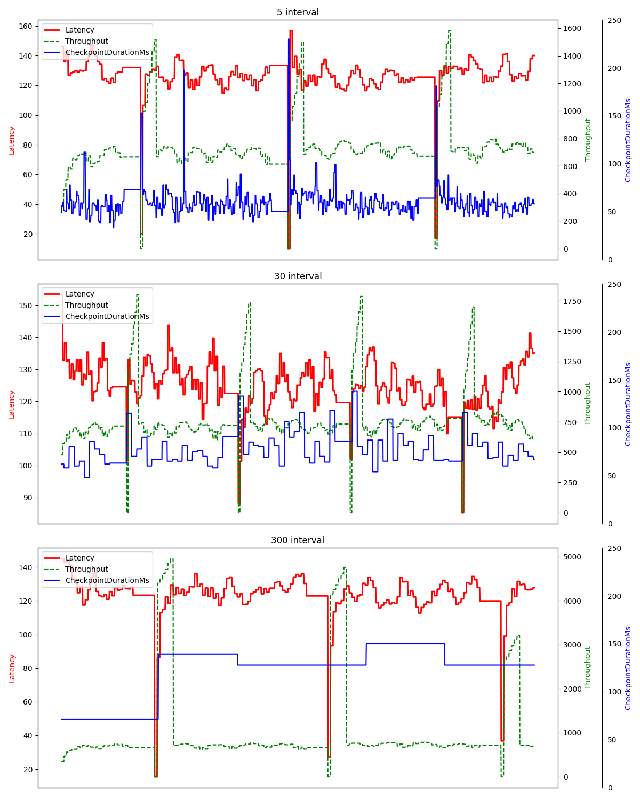
接下来我们会细化这张图的内容，进行详细的分析

#### 1. **Checkpoint间隔与吞吐量的关系**

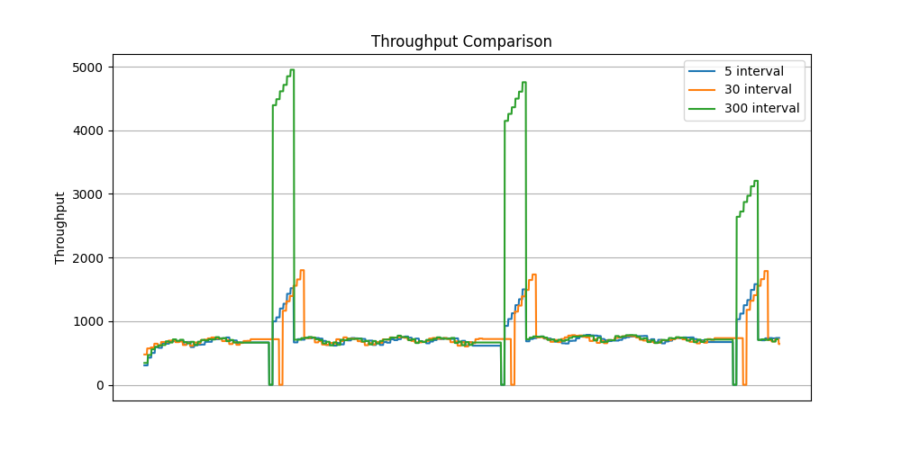

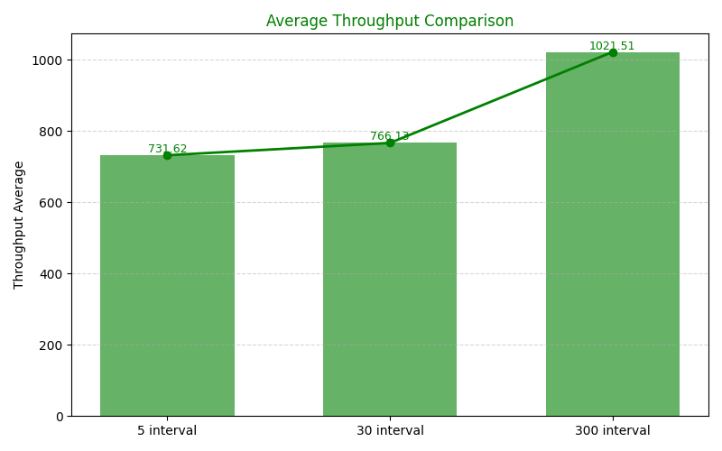

可以从图中看到，300s的吞吐量峰值要远高于其他两个相对短间隔,平均吞吐量也更高。但是由于峰值对平均值的影响比较大，我们筛选了非故障时间的数据，再次计算了吞吐量平均值，结果如下：
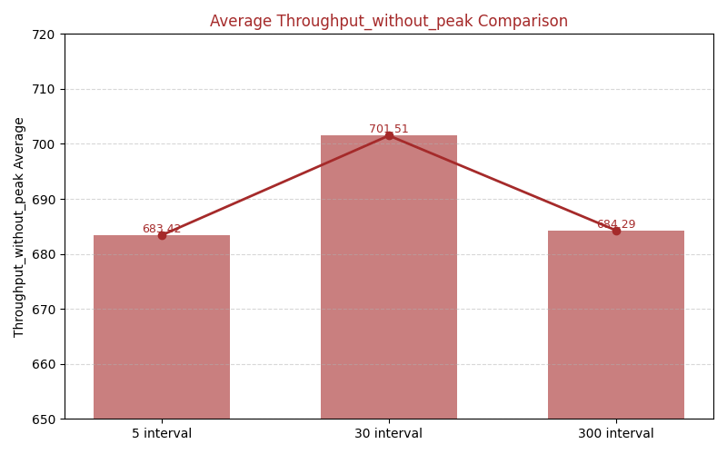
可以看到，在非故障时间，30s间隔的平均吞吐量是最高的

- **结论**：Checkpoint间隔越大，系统的平均吞吐量以及恢复过程中的吞吐量峰值越高。
- **分析**：频繁的Checkpoint会占用大量I/O和网络资源，导致实际数据处理资源减少。间隔增大后，Checkpoint开销降低，资源更多用于计算，因此吞吐量显著提升。

#### 2. **Checkpoint间隔与延迟的关系**

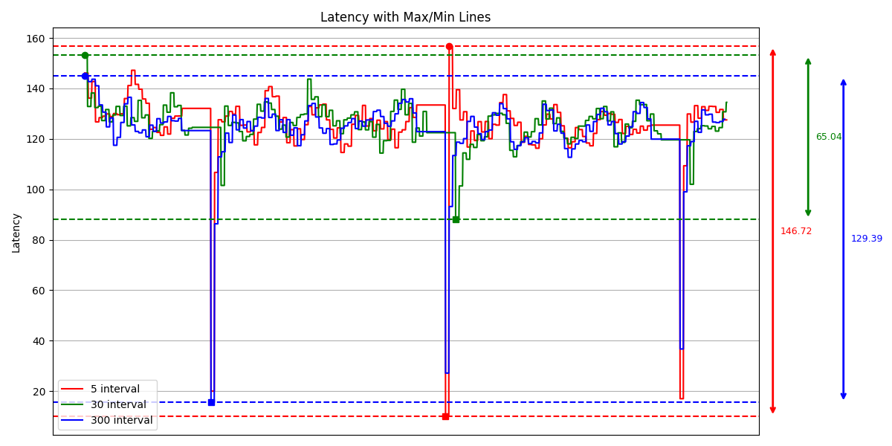
可以看出，在故障期间，Latency会产生比较大的波动，随后又恢复到正常状态。但是三种时间间隔下的**延迟尖峰**有较大的差异，可以看到30s间隔下的延迟峰值与延迟低值的差距是最小的，波动性远优于其他两个间隔
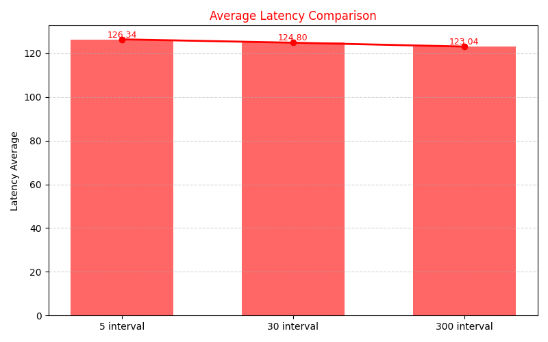
根据实验结果，我们计算了平均Latency，发现随着checkpoint间隔增大，Latency会逐渐降低，但是差异相对较小，这可能与我们的真实实验工作负载有关。

- **结论**：Checkpoint间隔越大，平均延迟越低。
- **分析**：频繁的Checkpoint会引起短暂的资源争用和状态冻结，增加数据处理等待时间。增大间隔减少了这类干扰，从而略微降低了处理延迟。

#### 3. **Checkpoint间隔与重启恢复时间的关系**

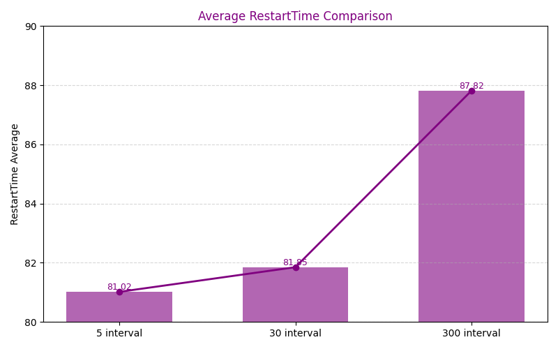
从图中可以看出，Checkpoint间隔越大，Restart Time会随之增加，在5min间隔下对比更为明显。

- **结论**：Checkpoint间隔越大，重启恢复时间增加。
- **分析**：恢复时间取决于最近一次Checkpoint的大小。间隔越大，状态积累越多，恢复时需要加载的状态量稍大。

#### 4. **Checkpoint间隔与Checkpoint Duration的关系**

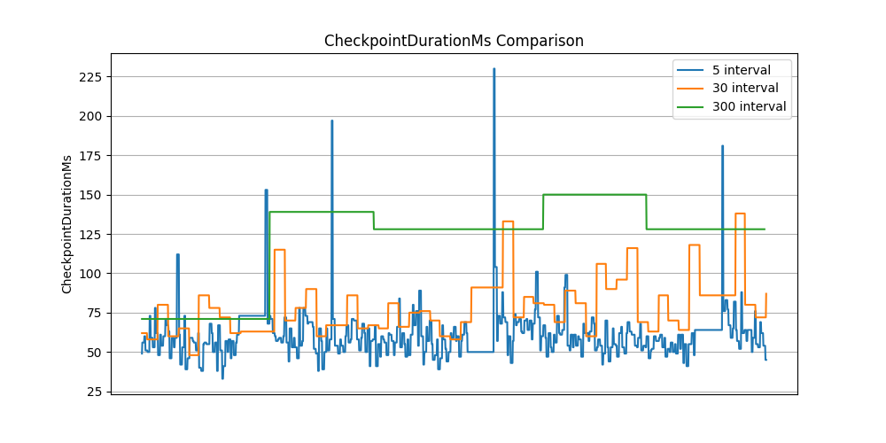
从图中可以看出，Checkpoint间隔越大，Checkpoint Duration也会变大。但是也可以看出，随着Checkpoint间隔越大，Checkpoint Duration的波动也会更加趋于稳定。

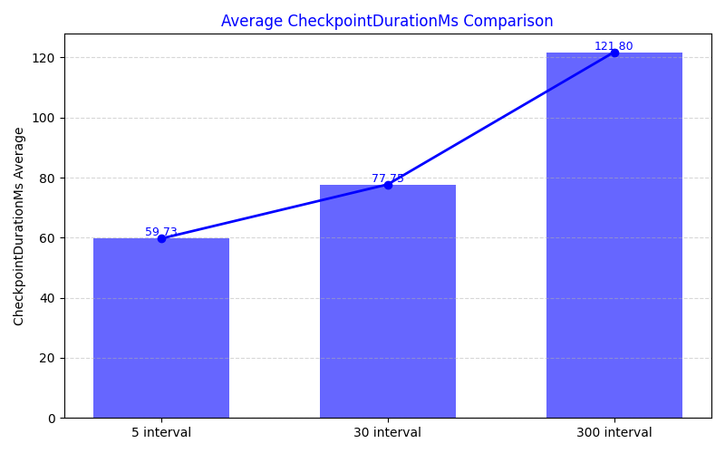

- **结论**：Checkpoint间隔越大，Checkpoint Duration随之增大。
- **分析**：Checkpoint间隔越大，应用累计的状态数据越多，需要序列化和持久化的状态量越大，导致单次Checkpoint的执行时间（Duration）相应增长。

### 结论总结
| 指标           | 5s 间隔         | 30s 间隔              | 5min 间隔          | 结论 |
|----------------|------------------|------------------------|---------------------|------|
| 吞吐量         | 低               | 高（稳态最佳）        | 极高（峰值）        | 间隔越大，IO 开销越小，吞吐越高 |
| 延迟           | 高（频繁抖动）  | 低（平稳）            | 最低               | 30s 间隔有效避免频繁 Checkpoint 导致的资源争抢 |
| 恢复时间       | 短               | 中（可接受）          | 长                 | 间隔越长，需要重放的数据越多，恢复越慢 |
| 检查点持续时间 | 短               | 中（可接受）          | 长                 | 间隔越长，累计状态越大，Checkpoint 序列化与持久化耗时越长 |


### 2. 为什么 30秒 是最佳选择？

根据实验数据与理论推导，**30s** 在本场景下达成了最佳平衡：

1. **吞吐量与延迟的平衡**

30秒间隔虽然在平均吞吐量和峰值吞吐量方面不如5min间隔，但是在稳态环境下的平均吞吐量是最高的，同时保持了与5分钟间隔相近的低延迟表现。

2. **波动可控性最佳**

在30秒间隔下，系统延迟波动最小，同时Checkpoint Duration波动虽然不及5min间隔稳定，但是要远远优于处于最可控范围：

- **5秒间隔**：尖峰频繁，规律性强，影响实时性体验。
- **5分钟间隔**：虽然平均延迟低，但一旦出现故障，状态回退时间长，可能导致较长时间的数据重算。
- **30秒间隔**：既避免了频繁尖峰，又保持了较好的恢复点时效性。

3. **故障恢复与状态时效性的权衡**

- 30秒间隔能够保证在发生故障时，状态回退时间较短（最多丢失30秒数据），适合对数据新鲜度要求较高的场景。
- 5分钟间隔在故障时可能导致过长时间的数据重算。

4. **资源利用效率高**

   30秒间隔既避免了频繁Checkpoint的资源损耗，又不会因间隔过长导致状态过大影响恢复效率。

   #### 资源利用率计算结果


   $$
   U = \frac{\lambda e^{\delta \lambda} (T - c)}{e^{\lambda(R + T + \delta n)} - e^{\lambda(R + \delta n)}}
   $$


   | 间隔 (T) | 检查点成本 (c)  | 恢复成本 (R)   | 系统利用率 (U)         |
   | :------- |:-----------|:-----------|:------------------|
   | 300s     | 1.218s     | 87.82s     | ≈ 66.3%           |
   | **30s**  | **0.778s** | **81.85s** | **≈ 82.9% (Max)** |
   | 5s       | 0.597s     | 81.02s     | ≈ 76.6%%          |

#### 理论验证：最佳间隔推导

为了验证实验得出的 30s 是否为理论最优，我们引用了论文《Optimizing checkpoint-based fault-tolerance in distributed stream processing systems: Theory to practice》中的数学模型。

##### 理论最优解公式

最优检查点间隔 $T^*$ 的计算公式为：

$$
T^* = \frac{c \lambda + W(-\mathrm{e}^{-c \lambda - 1}) + 1}{\lambda}
$$

* $c$ (Checkpoint Cost)
* $\lambda$ (Failure Rate)
* $W$ (Lambert W Function)

##### 验证结论

代入实验参数计算得出理论最优值 **$T^* \approx 28.73s$**。
此结果与我们实验中观察到的 **30s** 最佳实践高度一致，充分证明了实验结论的可靠性。

### 建议的检查点间隔设置策略：

1. 低延迟优先场景：若业务对故障恢复时间要求严苛（如金融实时风控），可选择较短间隔，但需权衡接受一定的吞吐量损失。
2. 高吞吐优先场景：若业务对延迟敏感度较低、追求极致吞吐量（如离线数据补算），可选择较长间隔，但需确保故障恢复时间在可接受范围内。
3. 动态调整策略：未来可探索基于实时监控数据的动态调整机制，根据状态大小变化、数据流速波动、集群负载情况自适应调整检查点间隔，实现更精细化的资源管理。

---

### 实验结论：

实验证实，检查点间隔对Flink系统性能存在显著影响。针对本次实验的纽约出租车数据集处理场景，**30s检查点间隔在吞吐量、延迟与故障恢复时间之间取得了最佳平衡**，为该场景下的最优配置。具体表现为：短间隔因频繁快照导致吞吐量下降、延迟升高；长间隔虽提升吞吐量，但大幅延长故障恢复时间，可用性降低。

因此，实际生产环境中需结合作业特性，综合考量**系统故障率、检查点成本、重启成本、应用结构**等核心因素，动态选择适配的检查点间隔，并通过持续监控与迭代调优实现性能与可用性的最优平衡。

## 团队分工


| 成员       | 职责                                           |
| :--------- | :--------------------------------------------- |
| **闭玉申** | 实验环境搭建、核心流程实现、集群部署           |
| **唐小卉** | 工作负载定义、指标采集方案、监控开发、结果分析 |
| **余婧**   | 数据可视化、脚本性能优化、结果补充分析         |
| **仲韦萱** | 预实验验证、问题排查、PPT制作与汇报            |
